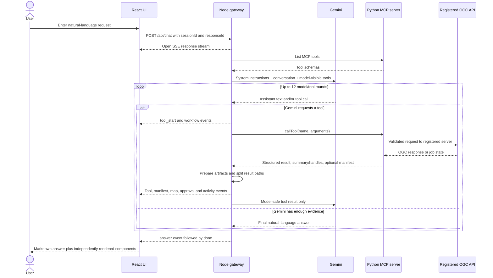
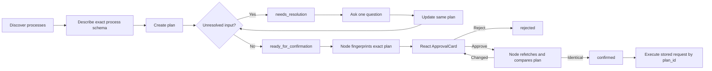
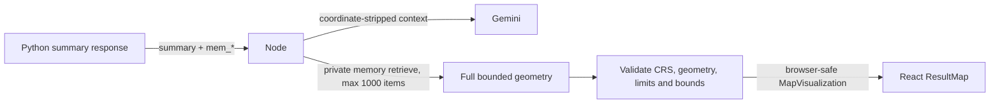

# Complete System Flow and Rendering Architecture

## 1. Purpose and scope

This report describes the complete request, reasoning, execution, storage, and
rendering flow implemented by the OGC MCP reference system. It covers the four
main application layers:

- the React user interface;
- the Node.js gateway;
- the Gemini language model;
- the Python MCP reference server.

It also covers the registered upstream OGC APIs, the human-confirmed process
workflow, proxy memory, process-output artifacts, asynchronous jobs, the data
boundary around the language model, and the UI renderer-selection mechanism.

The implementation is an experimental reference system for design,
interoperability, and research. It is not an adopted OGC Standard.

## 2. Architectural summary

The browser never talks directly to Gemini, Python, Redis, or an upstream OGC
API. The Node gateway is the browser-facing application server and the MCP
client. The Python process is the authoritative OGC proxy and execution layer.
Gemini selects model-visible tools and produces natural-language responses, but
it does not render UI components, fetch private artifacts, or approve process
execution.

| Layer | Primary responsibility | Does not own |
| --- | --- | --- |
| React UI | Chat state, event routing, approvals, and visual rendering | OGC execution, model reasoning, artifact interpretation |
| Node gateway | Session orchestration, Gemini loop, MCP client, safety filtering, renderer preparation, SSE | Authoritative geospatial computation |
| Gemini | Tool selection, bounded-result reasoning, and final prose | Approval, raw artifact access, map rendering |
| Python MCP server | Registered-server access, validation, planning, execution, memory, output parsing and artifact storage | React components and final conversational prose |
| Registered OGC APIs | Authoritative Common, Features, Records, Processes and Jobs behavior | Client orchestration and presentation |

The most important system boundary is:

> One MCP tool result becomes two different products in Node: a bounded,
> coordinate-stripped context for Gemini and a separately verified presentation
> payload for React.

## 3. End-to-end request flow



### 3.1 React starts the turn

React creates a user message and an empty pending assistant message. It sends
`POST /api/chat` with the text, session ID, and assistant response ID. The HTTP
response is an SSE stream, allowing one assistant message to accumulate
progress, tool activity, approval controls, manifests, maps, and the final
answer without waiting for the entire workflow to finish.

React also opens a session-scoped event stream for background job updates. This
second stream allows an asynchronous process to update the original assistant
message after the initial chat request has completed.

### 3.2 Node constructs the Gemini request

The Node gateway keeps conversation messages in an in-process session map. At
the beginning of a turn it asks the Python MCP server for its tool list, removes
tools that must not be callable by the model, converts the remaining MCP schemas
to function-tool schemas, and sends the conversation and schemas to Gemini
through Google's OpenAI-compatible endpoint.

Two tools are deliberately hidden from Gemini:

- `ogc_proxy_confirm_plan`, because approval must be a direct human action;
- `ogc_proxy_artifact_retrieve`, because protected artifact hydration is a
  gateway-only renderer operation.

### 3.3 Gemini chooses the next action

Gemini can return:

- final assistant text;
- one or more MCP tool calls;
- short user-facing commentary accompanying those calls.

If it returns a tool call, Node validates the tool against its policy and calls
the Python MCP server through the MCP SDK. The local UI configuration launches
the Python server as a long-lived stdio child process. Tool calls have a bounded
timeout, with a three-minute default.

Node appends a safe form of every tool result to the conversation and invokes
Gemini again. This continues until Gemini returns no more tool calls or the
gateway reaches its configured limit of 12 rounds.

### 3.4 Python executes the MCP tool

The Python MCP tool boundary parses and validates arguments, selects the
registered server profile, injects operator-managed credentials, and invokes
the appropriate service module. The server registry prevents an MCP caller
from replacing a configured server ID with an arbitrary upstream host.

The service may perform discovery, fetch features or records, validate a
process plan, execute a process, inspect an asynchronous job, or retrieve a
stored object. The resulting Python object is returned as a structured MCP
result envelope.

## 4. Human-confirmed process execution

Process execution uses a stateful workflow instead of sending model-proposed
inputs directly upstream:



The Python planner applies fixed validation rules to Gemini's proposed plan. It
checks the operation, process description, required inputs, conservative simple
types and occurrences, material unit/CRS/origin assumptions, declared source
collections, source URLs, and registered-server boundaries.

Ordinary input corrections update the same plan. A wrong process ID or wrong
source metadata requires rediscovery and a new plan because those fields are
immutable on an existing plan.

When a plan becomes `ready_for_confirmation`, Node creates a SHA-256 digest over
the plan ID, server ID, exact `execute_request`, input context, and steps. React
shows those exact values in `ApprovalCard`. The button sends an HTTP POST
directly to Node; approval never passes through Gemini. Before confirming, Node
fetches the current plan again and recomputes the digest. Any change invalidates
the review and requires the user to inspect the new version.

`ogc_proxy_execute_plan` accepts a `plan_id` and execution preferences, not a
replacement request body. Python reloads the stored, confirmed
`execute_request`, chooses an available synchronous/asynchronous mode, and sends
that exact request upstream.

## 5. Large-result handling and proxy memory

### 5.1 Why proxy memory exists

Feature collections, records, process results, and job outputs can be too large
for a language-model context and may contain large coordinate arrays. For tools
that can return unbounded data, `response_mode="summary"` is the default.

In summary mode Python:

1. keeps the full `result["data"]` value;
2. creates a bounded, sanitized summary;
3. stores the full value and summary in `ProxyMemoryStore`;
4. replaces `result["data"]` with the summary;
5. returns an opaque `mem_<uuid>` handle alongside the summary.

The initial Node tool result therefore does not normally contain the full large
payload. It contains a model-oriented summary and a handle. This distinction is
important: Node may later retrieve a bounded part of the full object privately
for rendering, but that hydrated object is not automatically added to Gemini's
conversation.

### 5.2 Python summary behavior

`ResponseSanitizer` defaults to at most 20 summarized items and 500 characters
per string. For feature collections, default fields include:

- `id`;
- `geometry.type`;
- `properties.name`;
- `properties.title`;
- `properties.description`.

If an entire geometry object is selected, its coordinate or geometry arrays are
removed. The sanitizer also replaces common instruction-like upstream strings
with `[removed]`, caps nested containers, and returns a `truncated` flag for
bounded collections.

`ogc_features_query` has a specialized path: it returns a coordinate-free facts
table plus evidence-completeness metadata, while the complete feature
collection is placed behind one memory handle. Gemini should use the facts
envelope for factual answers and should not hydrate the handle merely to inspect
scalar properties.

### 5.3 Memory retrieval

`ogc_proxy_memory_retrieve` accepts a handle, offset, and limit. Feature
collections are paged over their `features` array; flat lists are sliced; scalar
or object values are returned as a whole. Responses report counts and
`has_more` where applicable.

The Node renderer path privately retrieves at most 1,000 stored items for a map
or output preview. If more items exist, the visualization is marked truncated
and the user receives a warning. Failure to hydrate a summary-only result does
not produce a misleading empty map; the map presentation is omitted or marked
unavailable.

### 5.4 Storage backend and expiry

Plans, proxy memory, and artifacts use separate namespaces over the same
`KeyValueStore` abstraction:

| Stored object | Handle/key style | Default TTL |
| --- | --- | --- |
| Execution plan | `plan_<uuid>` | 1 hour |
| Proxy memory record | `mem_<uuid>` | 30 minutes |
| Output artifact | `art_<uuid>` | 30 minutes |

The default backend is process-local memory. It is suitable for one Python
worker but disappears on restart and cannot be shared across replicas. The
Redis backend is required when a Streamable HTTP deployment has multiple
workers or replicas. A configured TTL of zero disables expiry.

Python plan, memory, and artifact storage is currently deployment-wide rather
than scoped to a particular end user. Node adds session scoping when it exposes
artifact downloads to the browser, but this does not remove the Python-layer
multi-tenant limitation.

Node also keeps several volatile, process-local maps:

| Node state | Purpose | Lifetime |
| --- | --- | --- |
| Conversation session | Gemini message history | Until the session is cleared or Node restarts |
| Approval challenge | One-time plan digest bound to a browser session | 15 minutes by default, then pruned |
| Background job | Polling controller and target assistant message | Until terminal state, cancellation, timeout, or restart |
| Session artifact registry | `art_*` handles allowed for browser retrieval | Until the session is cleared or Node restarts |

These Node maps are not Redis-backed in the current implementation.

## 6. Node's second model-safety boundary

Python summary mode and Node model filtering are separate defenses.

After receiving an MCP result, Node parses its structured payload and prepares
renderer artifacts. It then calls `modelToolResultText` to produce the text that
is appended to Gemini's message history.

For ordinary bounded tools, Node recursively applies
`coordinateStrippedSummary`. This removes coordinate-bearing values, geometry,
bounds, latitude/longitude fields, secrets, spatial documents, deep nested
objects, and oversized collections while preserving safe identifiers and
scalar facts. Process-description schema metadata is handled specially so
input/output definitions remain usable without admitting runtime coordinate
data.

For strict process-output tools—`ogc_proxy_execute_plan`,
`ogc_processes_execute`, and `ogc_jobs_get_results`—Node withholds the raw output
and gives Gemini:

- compact execution-control facts;
- verified scalar outputs, when safe;
- a compact authoritative output-manifest summary;
- retrieval, interpretation, and presentation states;
- warnings and clarification questions.

This prevents Gemini from treating “HTTP success,” “process succeeded,” “output
retrieved,” and “map displayed” as the same fact.

Raw mode exists for deliberately small interoperability tests. It should not be
used to place large coordinate collections into model context.

## 7. Process-output artifact pipeline

Proxy memory protects general large tool responses. Process outputs have a
second, richer artifact system because successful execution does not imply that
an output was retrieved, parsed, or renderable.

### 7.1 Python artifact processing

The Python `OutputArtifactPipeline` performs the following steps:

```text
sync response or async job result
  -> extract advertised named outputs
  -> resolve allowed inline values or references
  -> detect media type
  -> select a parser adapter
  -> classify semantic type
  -> store original representation
  -> optionally store complete canonical representation
  -> create and store bounded preview representation
  -> advertise presentation candidates
  -> return output_manifest
```

The original response is preserved as an `art_*` representation. A parser may
also create a canonical representation, such as normalized GeoJSON, and a
bounded renderer preview. Preview truncation retains complete features or rows;
it does not cut JSON or geometry in the middle. The standard preview budget is
100 KB, with up to 500 complete vector features or 100 complete rows where they
fit.

### 7.2 Output manifest

An `ogc-output-manifest/1` document separates four independent questions:

1. Did execution succeed, fail, or remain in progress?
2. Was each output retrieved?
3. Was its format and semantics recognized?
4. Which browser presentations are actually available?

Each output can contain:

- retrieval state, source, media type, byte count, and error;
- semantic type, format, CRS, axis order, bounds, counts, units, and warnings;
- original, canonical, preview, or tile representations;
- map, table, chart, metric, image, text, or download presentations;
- provenance and transformations;
- structured clarification requests for ambiguous CRS, coordinates, units, or
  presentation choices.

### 7.3 Python's initial presentation recommendation

Python selects candidate presentations according to verified semantic facts:

| Semantic type | Python presentation decision |
| --- | --- |
| Vector | Map only with validated drawable coordinates; table when complete preview items exist; download always |
| Table | Bounded table; download |
| Time series | Table and chart; download |
| Scalar | Metric card; download |
| Image | Image presentation from original artifact; download |
| Document | Bounded text preview; download |
| Tiles | Partial map pending client URL validation; download |
| Raster/coverage | Map unavailable until a compatible preview/tiler exists; download |
| Unknown/binary | Unsupported presentation metadata plus download |

Missing or unsupported CRS, ambiguous axis order, invalid coordinate ranges,
empty feature sets, or a preview budget that cannot hold one complete drawable
feature makes a map explicitly unavailable. The system does not mount an empty
map and imply success.

## 8. Node artifact preparation and render verification

Python advertises what should be present; Node verifies what this browser client
can actually render.

For canonical output manifests Node:

1. normalizes the manifest contract;
2. privately hydrates required `art_*` canonical or preview representations;
3. enforces a default hydration budget of 8 fetches, 2.5 MB total, and 5 seconds;
4. limits an inline representation to 1.25 MB;
5. constructs a browser-safe map visualization when coordinate data validates;
6. downgrades stale or invalid presentations instead of leaving them “ready”;
7. registers artifact handles against the current Node session;
8. adds session-scoped `/api/artifacts/art_*?sessionId=...` URLs;
9. produces activity events and the compact verified context for Gemini.

The Node session registry retains at most 2,000 artifact handles. A browser
download request is accepted only when that exact `art_*` handle was previously
advertised to the same session. Node then calls the renderer-internal Python
artifact tool and returns a safe inline image or attachment. Arbitrary upstream
URLs are never accepted by this route, and the downloaded artifact never passes
through Gemini.

For legacy or non-manifest tool results, Node can use `mem_*` to retrieve a
bounded slice and build a compatibility manifest. New clients should prefer the
canonical Python manifest.

## 9. How coordinates reach the map without entering Gemini context

The coordinate path is deliberately different from the reasoning path:



Node's geospatial normalizer validates supported geometry types, finite
coordinates, geographic ranges, CRS, bounds, and structural limits. Default
limits include 12 layers, 2,000 features, 50,000 coordinates, 5,000 grid cells,
and a 1.25 MB browser payload. EPSG:3857 coordinates can be normalized to the
browser's geographic coordinate space; unsupported CRS values fail closed.

Point collections with at least 250 features become a heatmap when all retained
features are points. Other valid feature collections become vector layers.
`ResultMap` performs another browser-side normalization before mounting the data
with MapLibre GL. It supports vector, heatmap, raster, tile, and reference layer
descriptors, although remote raster/tile resources remain subject to safe URL
and user-action rules.

## 10. Node-to-React event protocol

Node streams independent event types instead of asking Gemini to encode UI
instructions into prose:

| Event | React behavior |
| --- | --- |
| `meta` | Records model, provider, session and tool count metadata |
| `status` / `reasoning_delta` | Updates safe progress and decision summaries |
| `tool_start` / `tool_result` | Adds bounded tool activity, timing, facts and warnings |
| `approval_request` | Adds a fingerprint-bound approval request |
| `output_manifest` | Adds or updates the canonical output lifecycle |
| `artifact_status` / `workflow_event` | Updates execution, retrieval, interpretation and presentation stages |
| `map_data` | Adds a verified legacy/browser map visualization |
| `job_status` | Updates background-job activity and progress |
| `answer` | Sets Gemini's final natural-language content |
| `done` / `error` | Completes or fails the assistant message |

`App.tsx` routes each event to the assistant message identified by
`targetMessageId` or the current response ID. This keeps output and progress
attached to the turn that created them.

## 11. Supported React visualizations

The final assistant message is a composition of independent React components:

- `ActivityFeed` for status, reasoning summaries, tools, jobs, workflow events,
  and artifact stages;
- `MessageBubble` plus `ReactMarkdown` for Gemini's prose;
- `ApprovalCard` for the exact human-confirmation request;
- `OutputPanel` for manifest-driven output presentations;
- `ResultMap` for verified map visualizations;
- explicit fallback and error cards when output cannot be safely presented.

`OutputPanel` contains a renderer registry keyed by `presentation.kind`:

| `presentation.kind` | React renderer | Required usable data |
| --- | --- | --- |
| `map` | `MapRenderer` -> `ResultMap` | At least one validated drawable vector, heatmap, raster, or tile layer |
| `table` | `TableRenderer` | Bounded GeoJSON properties or tabular rows/columns |
| `chart` | `ChartRenderer` | Bounded numeric array or records with numeric series; at most 80 points and 4 series |
| `metric` / `scalar` | `MetricRenderer` | Inline scalar or bounded scalar object |
| `image` | `ImageRenderer` | Safe image artifact URL or inline image value |
| `text` / `document` | `TextRenderer` | Printable bounded representation |
| `download` | `DownloadRenderer` | Session-scoped safe artifact URL |
| unknown | `UnknownRenderer` | Metadata and optional download; never an invented preview |

The UI renders a presentation only when its manifest state is `ready` or
`partial`. A `preparing` state shows progress. An `unavailable` state shows the
manifest's reason. If no presentation exists, the UI states that the output was
retained without a preview.

A ready manifest-owned map supersedes the older `map_data` compatibility path,
preventing a canonical map and a stale legacy map from appearing together.

### 11.1 Map renderer

`ResultMap` uses MapLibre GL. It normalizes features and layer styles, computes
bounds and geometry counts, supports layer visibility, displays selected
feature properties, and fits the map to valid result bounds. A configured
MapLibre style may provide a basemap. An explicitly empty style URL selects a
network-free privacy canvas. Basemap failure does not remove the result layer.

### 11.2 Table renderer

The table renderer accepts feature properties, arrays of records, or explicit
row/column data. It displays at most 100 preview rows and reports when the
canonical output contains more rows.

### 11.3 Chart renderer

The chart renderer creates an accessible SVG line chart from bounded numeric
data. It supports up to 80 points and four numeric series. Unsupported or
non-numeric data produces an honest “chart preview unavailable” card.

### 11.4 Metric, image, text and download renderers

Metric cards display scalar values or a bounded set of named scalar fields.
Images require a safe browser URL. Text uses a bounded preformatted preview.
Downloads use only the session-scoped Node artifact route and are disabled when
no safe URL is present.

## 12. Asynchronous execution and message updates

When execution returns `201`, `202`, or a recognized pending state with a usable
job ID, Node registers a background job. The default polling interval is three
seconds and the default overall timeout is 30 minutes.

The background worker calls job-status tools until the job succeeds, fails, or
times out. On success it calls `ogc_jobs_get_results`, runs the same artifact
pipeline used for synchronous results, and publishes `job_status`,
`output_manifest`, `artifact_status`, and optional `map_data` events to the
session event source.

There is one current client-side compatibility limitation: the dedicated
background `EventSource` registers listeners only for `job_status` and
`map_data`. Consequently, background job activity and a prepared legacy map
update the existing React message, while background `output_manifest`,
`artifact_status`, and `workflow_event` publications are not yet consumed by
that separate browser subscription. Those event types are fully handled when
they arrive on the primary `/api/chat` stream. Extending the background
subscription to the canonical manifest/workflow events would make asynchronous
rendering use the same complete `OutputPanel` path as synchronous rendering.

If the upstream job reports success before results are published, the gateway
uses bounded retries for transient or explicitly retryable result states. It
never executes the process a second time. A supposedly asynchronous response
without a job ID or tracking location is terminally marked unavailable rather
than leaving an endless spinner.

## 13. Final natural-language response

After each safe tool result is appended to the conversation, Gemini decides
whether another tool is necessary. When it returns no tool calls, Node applies
evidence qualification checks, emits the `answer` event, records the updated
conversation session, and emits `done`.

The final visible assistant turn may therefore contain all of the following at
once:

1. an activity timeline generated from deterministic gateway events;
2. Gemini's Markdown natural-language answer;
3. an approval card if execution awaits a human decision;
4. manifest-driven maps, tables, charts, metrics, images, text, or downloads;
5. warnings, clarification prompts, or failure cards.

Only the prose is generated by Gemini. Component selection and visual rendering
are controlled by Node's verified event data and React's renderer registry.

## 14. Security and trust boundaries

The architecture relies on several complementary boundaries:

- upstream calls target operator-registered OGC deployments only;
- credentials come from server-side environment variables and never enter tool
  schemas or model context;
- generic resource reads accept relative paths rather than arbitrary hosts;
- process input references are checked against configured host policy;
- direct process execution and job dismissal are hidden by default;
- approval and protected artifact retrieval are unavailable to Gemini;
- large responses are bounded by transport byte limits and timeouts;
- redirects are not followed generally; artifact-reference redirects are
  revalidated under a bounded output-resolution policy;
- Python sanitizes upstream summaries and Node independently strips coordinates
  and secrets before constructing model context;
- browser downloads require a session-registered opaque artifact handle;
- ambiguous output semantics become clarification or unavailable states rather
  than guessed visualizations.

Production deployments should add MCP authentication, authorization, TLS,
rate-limiting, audit logs, DNS-aware egress controls, secret management, and
per-user storage isolation.

## 15. Important implementation limits

- In-process Node chat, approval, job, and artifact-session state is lost when
  the Node gateway restarts.
- In-memory Python stores are not shared between workers and disappear on
  restart; Redis is required for replicated state.
- Python plan, memory, and artifact handles are not yet user-scoped.
- Summary and renderer hydration are intentionally bounded, so a displayed map
  or table may be a declared partial preview of a larger canonical artifact.
- The planner performs conservative high-confidence input checks rather than
  complete JSON Schema validation.
- Not every advertised capability fallback is implemented as actual geospatial
  computation.
- Raster and coverage outputs remain downloadable when no compatible preview
  adapter exists.

## 16. Implementation map

| Concern | Main implementation |
| --- | --- |
| Browser chat and event routing | [`../../ui/src/App.tsx`](../../ui/src/App.tsx) |
| Assistant message composition | [`../../ui/src/components/MessageBubble.tsx`](../../ui/src/components/MessageBubble.tsx) |
| Renderer registry and output cards | [`../../ui/src/components/OutputPanel.tsx`](../../ui/src/components/OutputPanel.tsx) |
| MapLibre result renderer | [`../../ui/src/components/ResultMap.tsx`](../../ui/src/components/ResultMap.tsx) |
| Human approval UI | [`../../ui/src/components/ApprovalCard.tsx`](../../ui/src/components/ApprovalCard.tsx) |
| Gemini tool loop and SSE emission | [`../../ui/server/agent.mjs`](../../ui/server/agent.mjs) |
| MCP stdio client | [`../../ui/server/mcp-client.mjs`](../../ui/server/mcp-client.mjs) |
| Model-visible tool policy | [`../../ui/server/tool-policy.mjs`](../../ui/server/tool-policy.mjs) |
| Model-context filtering | [`../../ui/server/model-output.mjs`](../../ui/server/model-output.mjs) |
| Manifest hydration and verification | [`../../ui/server/result-artifacts.mjs`](../../ui/server/result-artifacts.mjs) |
| Browser-safe map preparation | [`../../ui/server/geospatial.mjs`](../../ui/server/geospatial.mjs) |
| Background jobs | [`../../ui/server/background-jobs.mjs`](../../ui/server/background-jobs.mjs) |
| Node HTTP and SSE routes | [`../../ui/server/index.mjs`](../../ui/server/index.mjs) |
| MCP tool definitions and summary mode | [`../src/ogc_mcp_reference/app.py`](../src/ogc_mcp_reference/app.py) |
| Python runtime composition | [`../src/ogc_mcp_reference/runtime.py`](../src/ogc_mcp_reference/runtime.py) |
| Proxy memory | [`../src/ogc_mcp_reference/services/memory.py`](../src/ogc_mcp_reference/services/memory.py) |
| Python response sanitizer | [`../src/ogc_mcp_reference/services/sanitization.py`](../src/ogc_mcp_reference/services/sanitization.py) |
| Plan validation and lifecycle | [`../src/ogc_mcp_reference/services/planner.py`](../src/ogc_mcp_reference/services/planner.py) |
| Planning workflow | [`../src/ogc_mcp_reference/workflows/planning.py`](../src/ogc_mcp_reference/workflows/planning.py) |
| Python artifact pipeline | [`../src/ogc_mcp_reference/artifacts/pipeline.py`](../src/ogc_mcp_reference/artifacts/pipeline.py) |
| Pluggable memory/Redis store | [`../src/ogc_mcp_reference/services/store.py`](../src/ogc_mcp_reference/services/store.py) |
